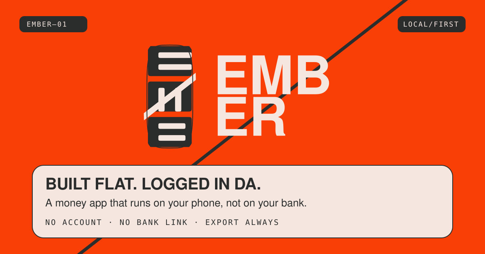

<p align="center">
  
</p>

<h1 align="center">Ember</h1>

<p align="center"><strong>A money app that runs on your phone, not on your bank.</strong></p>

<p align="center">
  <a href="https://github.com/Brvetr4ve1er/money-manager-/actions/workflows/ci.yml"></a>
  <a href="LICENSE"></a>
  
</p>

```
NO ACCOUNT  ·  NO BANK LINK  ·  EXPORT ALWAYS
```

Built for Algeria. Manual logging in dinars. Every
byte lives in your browser's local storage — there is no server, no sign-up
and nothing to connect. Close the tab and Ember has nothing on you.

---

## Who it is for

People who never link a bank. People paid in cash, in DA, across accounts no
aggregator supports. People who have tried a budgeting app, been lectured by a
spreadsheet, and stopped. Ember does not lecture. It logs, it scores, and it
tells you the tradeoff.

## The four mechanics

```
01/04  HEALTH SCORE    Five components. Shrunk for thin data. Explains; never advises.
02/04  THE RESIST      Kept, not spent. Summed for the month. The total is not a score input.
03/04  THE SIMULATOR   Baseline against scenario. States the tradeoff. Never the verdict.
04/04  THE MONSTER     Last week's spend is its HP. Beatable. Never shaming.
```

Around them: XP and levels for showing up, four daily quests (two of them
verified by the app, not by a tap), 30 collectible one-screen lessons, nine
earn-only badges with cosmetic companions, and chiptune cues that never carry
information alone.

## Trust rules

Product invariants. They outrank the design system and they outrank a feature.

- **XP never feeds the health score.** XP measures showing up. The score
  measures money. Engagement cannot buy a better avatar.
- **The simulator states tradeoffs, never verdicts.** It will tell you the goal
  slips two months. It will never say you can afford it.
- **Nothing is for sale.** Every badge, pet and stage is earned. No purchase
  path exists.
- **Honesty is never punished.** "I bought it anyway" logs at full XP, framed
  neutrally, and is what makes Impulse Control a real two-sided ratio.
- **Honest cold start.** Under 90 days the score says it is still calibrating
  rather than projecting confidence it has not earned.
- **Your data leaves when you do.** Full JSON export, always, one tap, no
  account.

## Run it

```bash
npm install
npm run dev
```

Vite 5 · React 18 · TypeScript strict · Vitest. No runtime dependency beyond
`react` and `react-dom`; no font CDN; the app renders fully offline.

```bash
npm test        # the engine, state and component suites
npm run build   # type-check and produce a production build
npm run brand   # regenerate every asset in public/ from the mark's geometry
```

`npm run brand` emits the favicon, the maskable icon, the social card and both
PNGs from `src/components/monogramGeometry.ts` — the same path data the app
renders its mark with, so a shipped asset cannot drift from the mark in the
product. The two PNGs (`og.png`, `apple-touch-icon.png`) exist because social
crawlers reject SVG and Safari ignores SVG touch icons; they are rasterised by
`scripts/raster.ts`, which is Node built-ins only — no rasteriser dependency,
runtime or otherwise. That writer has no font engine, so `og.png` renders §5
layout E (THE OBJECT — the mark alone on flat Flare, one 38° shear, no type)
while `og.svg` keeps layout A with its typeset lines. The words the card used
to carry are in `og:title`/`og:description`, which every crawler renders as
text beside the image.

## Install it

Ember ships a web manifest, so Android and desktop Chrome offer it as an app
and iOS gets a real add-to-home-screen icon. There is no app store listing and
there does not need to be — add-to-home-screen is the distribution channel.

## Deploying

Social-share crawlers (WhatsApp, Facebook, Telegram — the dominant channels in
the target market) require **absolute** `og:image`/`twitter:image` URLs and
silently drop relative ones. The canonical link has the same constraint. Set
the origin so `vite.config.ts` can rewrite the card URLs and emit the rest:

```bash
VITE_SITE_URL=https://ember.example.com npm run build
```

That injects `og:url` and `<link rel="canonical">`, rewrites the card URLs, and
emits `robots.txt` + `sitemap.xml` into `dist/`.

Deploy checklist:

- [ ] `VITE_SITE_URL` set to the canonical https origin (no trailing slash)
- [ ] `dist/index.html` contains absolute `og:image`/`twitter:image` URLs, an
      `og:url` tag and a `<link rel="canonical">`
- [ ] `dist/robots.txt` and `dist/sitemap.xml` present and pointing at that origin
- [ ] `/manifest.webmanifest`, `/icon.svg`, `/icon-maskable.svg` served
- [ ] `/og.png` (1200×630) and `/apple-touch-icon.png` (180×180) served, and
      regenerated with `npm run brand` if the mark changed — both are emitted
      from the mark's geometry and the output is byte-stable, so a re-run on an
      unchanged mark produces no diff

## Design

`docs/brand/BRAND-BOOK.md` is the reference: DNA, colour, type, logo
construction, voice, art direction, motion. `docs/brand/DESIGN-SYSTEM.md` is
the binding spec it summarises. Where the two disagree, the design system wins;
where the design system disagrees with a trust rule, the trust rule wins.

Three colours, one diagonal, everything in a rounded box. No drop shadows, no
white, no emoji as iconography, and a contrast law (§2.1) that is enforced
rather than aspirational — Flare is a field, never a text background, which is
why every string under 24px in this product sits on a plate.

## Project layout

- `src/engine/healthScore.ts` — Health Score Formula v0.1
- `src/engine/simulator.ts` — Decision Simulator Logic v0.1
- `src/engine/xp.ts` — XP, levels, and titles
- `src/engine/profile.ts` — user profile, demo fallback, calibration window
- `src/engine/boss.ts` — weekly boss battle engine
- `src/engine/achievements.ts` — badge roster and pixel pets
- `src/content/lessons.ts` — the 30-lesson codex content
- `src/state/store.ts` — local-first persistence, sanitization, multi-tab
  merge, and export
- `src/state/reducer.ts` — pure state transitions (XP grants, undo, rollover)
- `src/Root.tsx` — the cold-start gate: landing for a first visit, app after
- `src/components/Landing.tsx` — the marketing surface
- `src/components/monogramGeometry.ts` — the mark (§4), as computed geometry
- `src/components/` + `src/hooks/` — cards and the day/reward reaction logic
- `src/audio/chiptune.ts` — synthesized audio cues
- `src/styles/` — design tokens, app styles, landing styles
- `scripts/brand-assets.ts` — emits the shipped brand assets from the mark

## License

Apache-2.0. See [LICENSE](LICENSE).

---

No newsletter. We'll be here.
